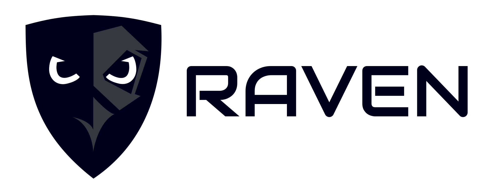

<p align="center">
</img>
Raven is a web application footpriting tool.
</p>

[](https://www.python.org)


## About

**Raven** is an open source intelligence (OSINT) automation tool. It uses flask web-server for providing a clean and intuitive web-based interface. It's written in **Python 3**.

## Installation
##### Clone repository
```
git clone https://github.com/Yugabdh/raven.git
cd raven
```
> __Note__:
> Create a Python virtual environment if you don't want to conflict with local packages and then install packages in that virtual environment.

```
python3 -m venv venv
```
##### Install Python packages
```
pip install -r requirements.txt
```
## Run
> __Note__:
> Currently, only GUI is available in form of a web interface. In the next version, there will be CLI included.
```
python3 -m raven
```